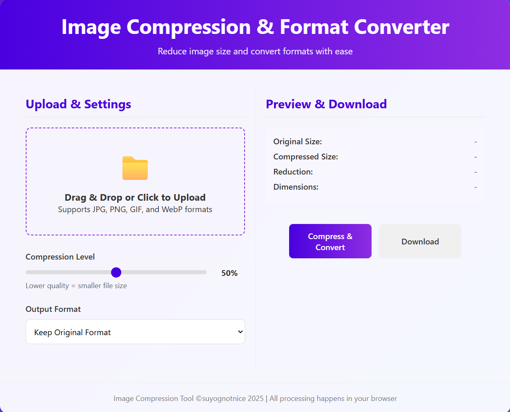

# image-compressor

A simple and efficient image compression tool and format changer that reduces the file size of images without compromising quality. Perfect for web developers, photographers, and anyone looking to optimize their images for faster loading times.

## Features

- Compress images in various formats including JPEG, JPG, PNG, WEBP.
- Change image formats easily.

